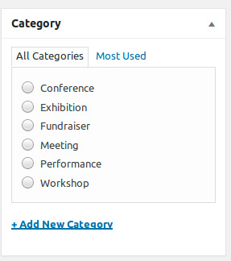
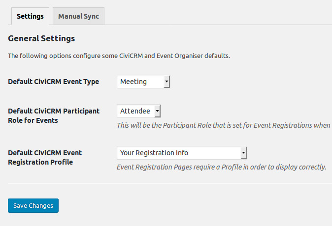

# CiviCRM Event Organiser Settings

Make sure **CiviCRM Event Organiser** and **Radio Buttons for Taxonomies** plugins are activated.

go to **Settings > Radio Buttons for Taxonomies** and select `Categories (event-categories)` and save. This needs to be done since only one Event Type can be selected in CiviCRM for each event.

Once you have done this, the Events Categories now will look like this:

And if the event is synced it will use the same Event Type in CiviCRM.

Then go to **Settings > CiviCRM Event Organiser** and define the default **General Settings** and **Manual Sync** any existing data between Event Organiser and CiviCRM and vice versa.

* Default CiviCRM Event Type
* Default CiviCRM Participant Role for Events
* Default CiviCRM Event Registration Profile

The **Manual Sync** settings allow you to do an initial sync if there is existing event information to from CiviCRM. It is recommended to run the **CiviCRM Event Types to Event Organiser Categories** so that the Event Types in CiviCRM match the Event Categories in Event Organiser.

Once completed you can now add and sync [events](./events.md).
